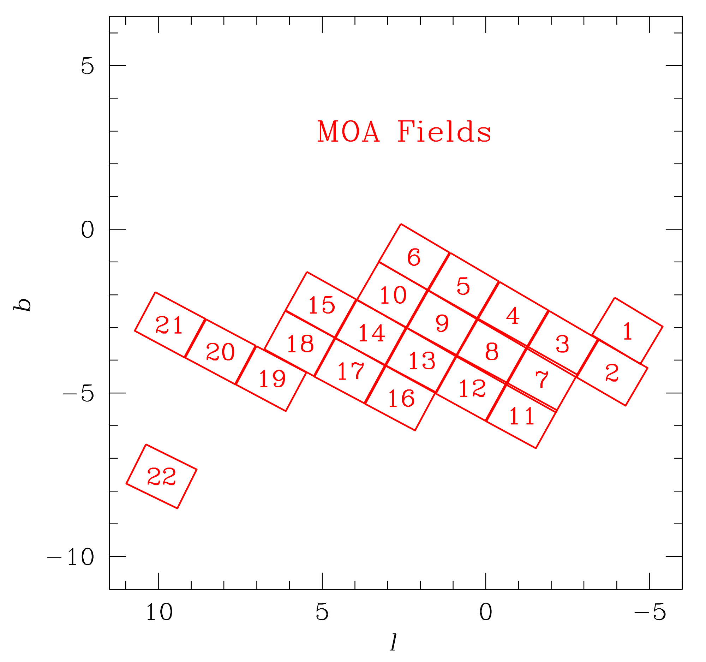

# Overview

Here we present the survey data from the Microlensing Observations in Astrophysics (MOA) collaboration, which operates a joint Japanese/New Zealand ground-based microlensing survey. In total, this data release includes approximately 2,400,000 photometric light curves, acquired from 2006 - 2014, using the 1.8m MOA telescope located at Mount John Observatory in New Zealand. These data span 22 target fields, the locations of which are shown in the observational coverage map below, were selected using the methodology described below, and have been made available to the public via the NASA Exoplanet Archive with help from the MOA collaboration.

# Data Products Description

The MOA dataset consists of two components. A collection of light curves, each of a which is a table of data, and the table of the metadata for all the light curves. Each row in each light curve table corresponds to a moment in time, and the related measurements and derived values for that moment in time. Each row in the metadata table corresponds to a light curve. There is one row in the metadata table for each light curve in the dataset.

## Metadata columns
| name                                     | human_readable_short_name   | units   | description                                                                                                                |
|:-----------------------------------------|:----------------------------|:--------|:---------------------------------------------------------------------------------------------------------------------------|
| field                                    | Field                       |         | Galactic bulge observing field number.                                                                                     |
| chip                                     | Chip                        |         | Chip number.                                                                                                               |
| subframe                                 | Subframe                    |         | Subframe number.                                                                                                           |
| id                                       | ID                          |         | Target identifier.                                                                                                         |
| tag                                      | Tag                         |         | Target classification.                                                                                                     |
| x                                        | x                           | pix     | Pixel position x coordinate.                                                                                               |
| y                                        | y                           | pix     | Pixel position y coordinate.                                                                                               |
| ra_j2000                                 | RA                          | deg     | Right ascension J2000.                                                                                                     |
| dec_j2000                                | Dec                         | deg     | Declination J2000.                                                                                                         |
| number_of_data_points                    | Number of data points       |         | Number of data points in light curve.                                                                                      |
| number_of_frames_object_is_detected      | Frames detected             |         | Number of frames in which the object is detected.                                                                          |
| max_significance                         | Max significance            |         | Significance at maximum significant point in light curve.                                                                  |
| sum_of_continuous_significance           | Sum significance            |         | Sum of significance of continuous significant points in light curve.                                                       |
| chi_squared_outside_search_window        | Chi squared outside window  |         | Chi square outside of the search window in light curve.                                                                    |
| dophot_object_reference_image_separation | DoPHOT reference separation | pix     | Separation in pixels to the closest DoPHOT object in the reference image.                                                  |
| dophot_id                                | DoPHOT ID                   |         | DoPHOT identifier.                                                                                                         |
| dophot_type                              | DoPHOT type                 |         | DoPHOT type.                                                                                                               |
| dophot_magnitude                         | DoPHOT magnitude            |         | DoPHOT magnitude.                                                                                                          |
| dophot_magnitude_error                   | DoPHOT magnitude error      |         | DoPHOT magnitude error.                                                                                                    |
| pspl_t0                                  | t_0 (PSPL)                  | d       | The time of minimum angular separation between lens and source in the fitted PSPL model.                                   |
| pspl_tE                                  | t_E (PSPL)                  | d       | The Einstein crossing time in the fitted PSPL model.                                                                       |
| pspl_u0                                  | u_0 (PSPL)                  |         | The minimum angular separation between lens and source normalized by the angular Einstein radius in the fitted PSPL model. |
| pspl_source_flux                         | Source flux (PSPL)          |         | The source flux in the fitted PSPL model.                                                                                  |
| pspl_blending_flux                       | Blending flux (PSPL)        |         | The blending flux in the fitted PSPL model.                                                                                |
| pspl_t0_parabolic_error                  | t_0 error (PSPL)            | d       | Parabolic error in `pspl_t0`.                                                                                              |
| pspl_tE_parabolic_error                  | t_E error (PSPL)            | d       | Parabolic error in `pspl_tE`.                                                                                              |
| pspl_tE_error_lower_limit                | t_E lower limit (PSPL)      | d       | Lower limit error in `pspl_tE`.                                                                                            |
| pspl_tE_error_upper_limit                | t_E upper limit (PSPL)      | d       | Upper limit error in `pspl_tE`.                                                                                            |
| pspl_u0_parabolic_error                  | u_0 error (PSPL)            |         | Parabolic error in `pspl_u0`.                                                                                              |
| pspl_u0_error_lower_limit                | u_0 lower limit (PSPL)      |         | Lower limit error in `pspl_u0`.                                                                                            |
| pspl_u0_error_upper_limit                | u_0 upper limit (PSPL)      |         | Upper limit error in `pspl_u0`.                                                                                            |
| pspl_source_flux_error                   | Source flux error (PSPL)    |         | Error in `pspl_source_flux`.                                                                                               |
| pspl_blending_flux_error                 | Blending flux error (PSPL)  |         | Error in `pspl_blending_flux`.                                                                                             |
| pspl_chi_squared                         | Chi squared (PSPL)          |         | The chi squared statistic of the fitted PSPL model.                                                                        |
| fspl_t0                                  | t_0 (FSPL)                  | d       | The time of minimum angular separation between lens and source in the fitted FSPL model.                                   |
| fspl_tE                                  | t_E (FSPL)                  | d       | The Einstein crossing time in the fitted FSPL model.                                                                       |
| fspl_u0                                  | u_0 (FSPL)                  |         | The minimum angular separation between lens and source normalized by the angular Einstein radius in the fitted FSPL model. |
| fspl_rho                                 | rho (FSPL)                  |         | The angular source size normalized by the angular Einstein radius in the fitted FSPL model.                                |
| fspl_source_flux                         | Source flux (FSPL)          |         | The source flux in the fitted FSPL model.                                                                                  |
| fspl_blending_flux                       | Blending flux (FSPL)        |         | The blending flux in the fitted FSPL model.                                                                                |
| fspl_t0_parabolic_error                  | t_0 error (FSPL)            | d       | Parabolic error in `fspl_t0`.                                                                                              |
| fspl_tE_parabolic_error                  | t_E error (FSPL)            | d       | Parabolic error in `fspl_tE`.                                                                                              |
| fspl_tE_error_lower_limit                | t_E lower limit (FSPL)      | d       | Lower limit error in `fspl_tE`.                                                                                            |
| fspl_tE_error_upper_limit                | t_E upper limit (FSPL)      | d       | Upper limit error in `fspl_tE`                                                                                             |
| fspl_u0_parabolic_error                  | u_0 error (FSPL)            |         | Parabolic error in `fspl_u0`.                                                                                              |
| fspl_u0_error_lower_limit                | u_0 lower limit (FSPL)      |         | Lower limit error in `fspl_u0`.                                                                                            |
| fspl_u0_error_upper_limit                | u_0 upper limit (FSPL)      |         | Upper limit error in `fspl_u0`.                                                                                            |
| fspl_rho_parabolic_error                 | u_0 error (FSPL)            |         | Parabolic error in `fspl_rho`.                                                                                             |
| fspl_rho_error_lower_limit               | u_0 lower limit (FSPL)      |         | Lower limit error in `fspl_rho`.                                                                                           |
| fspl_rho_error_upper_limit               | u_0 upper limit (FSPL)      |         | Upper limit error in `fspl_rho`.                                                                                           |
| fspl_source_flux_error                   | Source flux error (FSPL)    |         | Error in `fspl_source_flux`.                                                                                               |
| fspl_blending_flux_error                 | Blending flux error (FSPL)  |         | Error in `fspl_blending_flux`.                                                                                             |
| fspl_chi_squared                         | Chi squared (FSPL)          |         | The chi squared statistic of the fitted FSPL model.                                                                        |
| separation_to_alert_position1            | Alert 1 separation          | pix     | Separation to alert 1 position.                                                                                            |
| alert_id1                                | Alert 1 ID                  |         | Alert 1 identifier.                                                                                                        |
| alert_x1                                 | Alert 1 x                   | pix     | Alert 1 x pixel position.                                                                                                  |
| alert_y1                                 | Alert 1 y                   | pix     | Alert 1 y pixel position.                                                                                                  |
| separation_to_alert_position2            | Alert 2 separation          | pix     | Separation to alert 2 position.                                                                                            |
| alert_id2                                | Alert 2 ID                  |         | Alert 2 identifier.                                                                                                        |
| alert_x2                                 | Alert 2 x                   | pix     | Alert 2 x pixel position.                                                                                                  |
| alert_y2                                 | Alert 2 y                   | pix     | Alert 2 y pixel position.                                                                                                  |

## Light curve columns

| name     | human_readable_short_name   | units   | description                                                                                                                                              |
|:---------|:----------------------------|:--------|:---------------------------------------------------------------------------------------------------------------------------------------------------------|
| HJD      | HJD                         | d       | Heliocentric Julian Date of observational epoch.                                                                                                         |
| cor_flux | Cor flux                    | ct      | Detrended flux.                                                                                                                                          |
| flux     | Flux                        | ct      | Number of counts measured for observational epoch: for a MOA magnitude of 20, this is 691.8 for magnitude of 20 for chip2 and 1,445 for all other chips. |
| flux_err | Flux error                  |         | Uncertainty in measured flux for observational epoch.                                                                                                    |
| obsID    | Observation ID              |         | Run number, i.e., B#.                                                                                                                                    |
| JD       | JD                          | d       | Julian Date of observational epoch.                                                                                                                      |
| fwhm     | FWHM                        |         | Seeing estimated from the full-width half-maximum (FWHM) in arcseconds.                                                                                  |
| sky      | Sky raw                     | ct      | Sky level in counts on raw images.                                                                                                                       |
| airmass  | Airmass                     |         | Airmass of observational epoch.                                                                                                                          |
| nstar    | Nstar                       |         | Number of resolved bright stars by probe" (it is small if there are problems on the image)."                                                             |
| scale    | Image scale                 |         | Numerical factor used to scale image relative to the reference image.                                                                                    |
| exptime  | Exposure time               | s       | Exposure time of the observational epoch in seconds.                                                                                                     |
| skydiff  | Sky difference              | ct      | Sky level in counts on the difference image (a residual of the Difference Imaging Analysis).                                                             |
| chisq    | Chi-squared                 |         | Chi-square of PSF fitting on the difference images. Two parameters are used in PSF fitting (χ2/dof is (/npix-2)).                                        |
| npix     | Npix                        |         | Number of pixels used in PSF fitting.                                                                                                                    |
| airmass1 | Cor airmass                 |         | Airmass calculated in the detrending code.                                                                                                               |
| ang1     | Cor angle                   | rad     | Angle relative to zenith calculated in the detrending code.                                                                                              |
| included | Included                    |         | Data included in fitting processes. Some data excluded due to bad quality flags.                                                                         |

# Using the Interactive Interface to Browse the Dataset

**To be filled by IPAC**

# Observational Coverage Map

This figure identifies the 22 target fields observed by the MOA survey, from which the approximately 2.4 million light curves were produced. Approximately 6,000 candidate events were identified.

# Data Selection Criteria
Here we describe the criteria used by the MOA collaboration to produce the full light curve dataset, and identify microlensing candidate events. This methodology is a slight variation of what is described in the Supplementary Information section of [Sumi, T., et al. (2011) Nature, 473, 349](https://ui.adsabs.harvard.edu/#abs/2011Natur.473..349S/abstract). Please refer to that manuscript for additional details.

## Cut-0:
On a subtracted image, variable objects can be seen as positive or negative point spread function (PSF) profiles depending on whether the target star is brighter or fainter than in the reference image. We use a custom implementation of the IRAF task DAOFIND to detect these variable objects (like microlensing events), with the modification that both positive and negative PSF profiles are searched for simultaneously. This algorithm finds difference image peaks with a signal-to-noise ratio $(S/N) > 5$ and then applies several additional criteria to avoid the detection of spurious variations that are not associated with stellar variability, such as cosmic ray hits, satellite tracks and electrons leaked from the saturated images of bright stars. The positions of detected objects are checked against those obtained in previous reductions of the field. When no object is cross-referenced, the object is classified as new and added to the list of variable object positions. If an object has previously been detected within 8 days, the number of continuous detections for this object, $N_{detect,continue}$, is incremented. We require that maximum of $N_{detect,continue}$ to be $>2$.

## Cut-1:
Light curves of the candidates passing Cut-0 were then created using PSF fitting photometry on the difference images. The photometric error bars were calibrated with constant stars in each sub-field. We place a 1400-day moving window on each light curve and define the baseline flux to be the weighted average flux outside of that window. We require the baseline to have more than 100 data points and calculated $\chi_{out}^{2}/dof$ for a constant flux fit. We then search for positive light curve "bumps" inside the 1400-day window, with a "bump" defined as a brightening episode with more than 3 consecutive measurements with excess $flux > 3\sigma'$ above the baseline flux, $F_{base}$. We define a statistic $\chi_{3+} = \Sigma_{i} (F_{i} - F_{base}) / \sigma_{i}'$ summed over consecutive points with $F_i - F_{base} > 3\sigma_{i}'$. We cut the objects if $\chi_{3+} < 40$ or ($\chi_{3+} < 75$ && $\chi^{2}_{out}/dof > 3$).

## The candidates were selected by eye inspection of these objects.
This sample include candidates which may be cut by microlensing light curve fitting in the detailed analysis.

# Software Used to Create the Dataset

## DoPHOT

DoPHOT is a common point spread function fitting (PSF) photometry program. DoPHOT uses a analytical function (a polynomial approximation to a 2-D Gaussian) to represent stellar profiles.

# MOA Data Acknowledgement
If you make use of data from this archive, please include the following acknowledgement:

This paper makes use of data obtained by the MOA collaboration with the 1.8 metre MOA-II telescope at the University of Canterbury Mount John Observatory, Lake Tekapo, New Zealand. The MOA collaboration is supported by JSPS KAKENHI grant and the Royal Society of New Zealand Marsden Fund. These data are made available using services at the NASA Exoplanet Archive, which is operated by the California Institute of Technology, under contract with the National Aeronautics and Space Administration under the Exoplanet Exploration Program.
