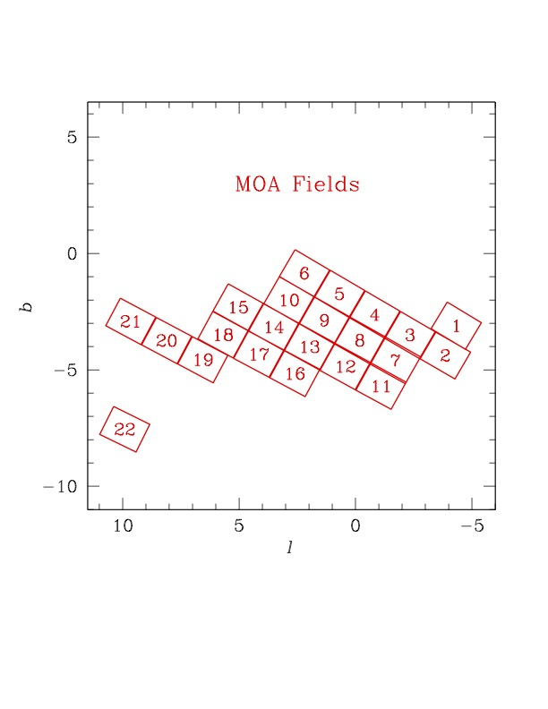

## Observational Coverage Map

This figure identifies the 22 target fields observed by the MOA survey, from which the approximately 2.4 million light curves were produced. Approximately 6,000 candidate events were identified.

## Data Selection Criteria
Here we describe the criteria used by the MOA collaboration to produce the full light curve dataset, and identify microlensing candidate events. This methodology is a slight variation of what is described in the Supplementary Information section of [Sumi, T., et al. (2011) Nature, 473, 349](https://ui.adsabs.harvard.edu/#abs/2011Natur.473..349S/abstract). Please refer to that manuscript for additional details.

### Cut-0:
On a subtracted image, variable objects can be seen as positive or negative point spread function (PSF) profiles depending on whether the target star is brighter or fainter than in the reference image. We use a custom implementation of the IRAF task DAOFIND to detect these variable objects (like microlensing events), with the modification that both positive and negative PSF profiles are searched for simultaneously. This algorithm finds difference image peaks with a signal-to-noise ratio $(S/N) > 5$ and then applies several additional criteria to avoid the detection of spurious variations that are not associated with stellar variability, such as cosmic ray hits, satellite tracks and electrons leaked from the saturated images of bright stars. The positions of detected objects are checked against those obtained in previous reductions of the field. When no object is cross-referenced, the object is classified as new and added to the list of variable object positions. If an object has previously been detected within 8 days, the number of continuous detections for this object, $N_{detect,continue}$, is incremented. We require that maximum of $N_{detect,continue}$ to be $>2$.

### Cut-1:
Light curves of the candidates passing Cut-0 were then created using PSF fitting photometry on the difference images. The photometric error bars were calibrated with constant stars in each sub-field. We place a 1400-day moving window on each light curve and define the baseline flux to be the weighted average flux outside of that window. We require the baseline to have more than 100 data points and calculated $\chi^{2}_{out}/dof$ for a constant flux fit. We then search for positive light curve "bumps" inside the 1400-day window, with a "bump" defined as a brightening episode with more than 3 consecutive measurements with excess $flux > 3\sigma'$ above the baseline flux, $F_{base}$. We define a statistic $\chi_{3+} = \Sigma_{i} (F_{i} - F_{base}) / \sigma_{i}'$ summed over consecutive points with $F_i - F_{base} > 3\sigma_{i}'$. We cut the objects if $\chi_{3+} < 40$ or ($\chi_{3+} < 75$ && $\chi^{2}_{out}/dof > 3$).

### The candidates were selected by eye inspection of these objects.
This sample include candidates which may be cut by microlensing light curve fitting in the detailed analysis.

## MOA Data Acknowledgement
If you make use of data from this archive, please include the following acknowledgement:

This paper makes use of data obtained by the MOA collaboration with the 1.8 metre MOA-II telescope at the University of Canterbury Mount John Observatory, Lake Tekapo, New Zealand. The MOA collaboration is supported by JSPS KAKENHI grant and the Royal Society of New Zealand Marsden Fund. These data are made available using services at the NASA Exoplanet Archive, which is operated by the California Institute of Technology, under contract with the National Aeronautics and Space Administration under the Exoplanet Exploration Program.
